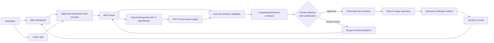
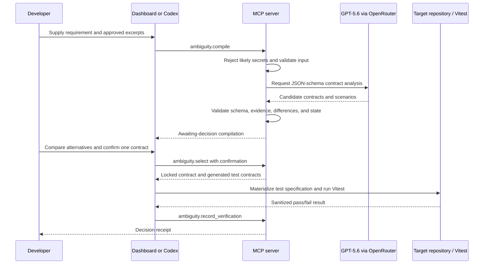

# Ambiguity Compiler

> Turn vague software requirements into human-approved, testable behavioral contracts before an agent implements the wrong interpretation.

**Ambiguity Compiler** is a local-first developer tool for making hidden product decisions explicit. It compiles a requirement and a small, approved context bundle into competing contracts, lets a person select the intended behavior, generates linked test contracts, records sanitized Vitest evidence, and produces a durable decision receipt.

Built for the **OpenAI Build Week — Developer Tools** track. Structured analysis uses the official OpenAI Responses API when configured, with the project-owner selected OpenRouter adapter retained for compatible models; the execution workflow is driven by Codex, a local MCP server, and deterministic validation.

## Contents

- [Why this exists](#why-this-exists)
- [Capabilities](#capabilities)
- [Architecture](#architecture)
- [Decision lifecycle](#decision-lifecycle)
- [Repository layout](#repository-layout)
- [Quick start](#quick-start)
- [MCP server](#mcp-server)
- [Configuration](#configuration)
- [Validation and tests](#validation-and-tests)
- [Security and data handling](#security-and-data-handling)
- [Development notes](#development-notes)

## Why this exists

Requirements like _“Users can export their monthly transactions”_ look simple but hide implementation-changing choices:

- Is “monthly” based on UTC or the user's display timezone?
- Are pending, reversed, or only posted transactions included?
- What happens at month boundaries, with empty exports, or after a failed job?

An AI coding agent can write correct code for the wrong interpretation. Ambiguity Compiler makes the alternatives visible, requires an explicit human decision, and attaches testable evidence to that decision.

## Capabilities

- **Structured compilation** — converts a requirement plus approved context into alternative contracts, acceptance criteria, and discriminating scenarios.
- **Human approval gate** — a contract cannot be locked without explicit confirmation.
- **MCP workflow** — exposes compilation, context, selection, test-generation, verification, history, and receipt tools through the official MCP SDK over stdio or Streamable HTTP.
- **Schema and semantic validation** — validates model output with Zod plus deterministic checks for evidence anchors, meaningful differences, scenarios, and state transitions.
- **Test traceability** — links acceptance criteria to generated Vitest contract specifications and a sanitized verification artifact.
- **Decision receipts** — captures the original requirement, scoped context, selected and rejected contracts, test contracts, verification result, and prompt/model version.
- **No-key walkthrough** — provides a seeded monthly-export demo at `/demo` for judges and contributors.

## Architecture



### Components

| Component                | Responsibility                                                                  | Persistence                                                  |
| ------------------------ | ------------------------------------------------------------------------------- | ------------------------------------------------------------ |
| TanStack Start dashboard | Review contracts, confirm selection, inspect traceability, and view receipts    | Calls the authoritative server-side JSON store               |
| MCP server               | Validates inputs, invokes the model, enforces workflow state, and exposes tools | Local JSON file at `mcp-server/.data/compilations.json`      |
| Model client             | Uses OpenAI Responses API or OpenRouter strict JSON Schema output               | No repository access                                         |
| Codex plugin             | Guides the developer through the safe workflow in the target repository         | Plugin/skill files in `codex-plugin/`                        |
| Verification scripts     | Runs fixture checks and writes a sanitized browser-consumable result            | `public/verification/` and ignored `artifacts/test-reports/` |

## Decision lifecycle



## Repository layout

```text
clarity-engine-main/
├── src/                              # TanStack Start application
│   ├── components/
│   │   ├── ac/                       # Ambiguity Compiler UI components
│   │   └── ui/                       # Reusable UI primitives
│   ├── hooks/                        # React hooks and browser workflow state
│   ├── lib/
│   │   └── ac/                       # Contracts, storage, verification, test helpers
│   ├── routes/                       # File-based application routes
│   ├── routeTree.gen.ts              # Generated; do not edit manually
│   └── styles.css                    # Theme and global styles
├── mcp-server/                       # Standalone stdio MCP service
│   ├── src/core.ts                   # Contract lifecycle and validation rules
│   ├── src/index.ts                  # MCP tool registration and dispatch
│   ├── src/persistence.ts            # File-backed local persistence
│   └── src/core.test.ts              # Core lifecycle tests
├── codex-plugin/                     # Installable Codex plugin and skill
│   ├── .codex-plugin/plugin.json     # Plugin manifest
│   └── skills/ambiguity-compiler/    # Guided workflow instructions
├── fixtures/monthly-export/          # Runnable before/after timezone example
├── scripts/                          # Contract, fixture, and plugin validators
├── public/                           # Browser-served assets and sanitized evidence
│   └── verification/                 # Safe verification artifacts
├── docs/                             # Project structure and submission notes
├── artifacts/test-reports/           # Local raw reports; ignored by Git
├── .env.example                      # Environment template; never commit `.env`
├── package.json                      # Web app scripts and dependencies
└── README.md                         # This guide
```

For contributor conventions and generated-file policy, see [`docs/PROJECT_STRUCTURE.md`](docs/PROJECT_STRUCTURE.md).

## Quick start

### Prerequisites

- [Bun](https://bun.sh/) 1.3 or later
- Node.js 22 or later (used by the verification artifact script)
- macOS, Linux, or Windows PowerShell
- An OpenAI API key or OpenRouter API key for live model-backed compilation

### Install

```powershell
git clone <your-repository-url>
Set-Location clarity-engine-main
bun install --frozen-lockfile
Copy-Item .env.example .env
```

Set `AMBIGUITY_COMPILER_MODEL_PROVIDER` and the matching server-only API key in `.env`. Never expose either key in a browser variable or commit it to source control.

### Start the dashboard

```powershell
bun run dev
```

| URL                                          | Purpose                           |
| -------------------------------------------- | --------------------------------- |
| `http://127.0.0.1:3001/`                     | Product landing page              |
| `http://127.0.0.1:3001/demo`                 | No-key seeded judge walkthrough   |
| `http://127.0.0.1:3001/app/compilations/new` | Live requirement compilation      |
| `http://127.0.0.1:3001/app/history`          | Authoritative workspace compilation history |

### Run the monthly-export walkthrough

1. Open `/demo`, then select **Open dashboard**.
2. Create or select a compilation for the monthly transaction export requirement.
3. Compare the timezone alternatives, explicitly lock the user-local contract, and open **Tests**.
4. Run `npm run test:contract:record` in a second terminal.
5. Use **Record latest Vitest result**, then open the generated receipt.

The end-to-end fixture proves the distinction: a deliberately buggy UTC-only export fails; the selected user-local implementation passes.

## MCP server

The local MCP server uses the official MCP TypeScript SDK over standard input/output by default. Set `MCP_TRANSPORT=http` for a Streamable HTTP endpoint on `127.0.0.1`. It only receives the requirement and caller-approved excerpts. It does **not** read repositories, `.env` files, or credential stores.

```powershell
Set-Location mcp-server
$env:AMBIGUITY_COMPILER_MODEL_PROVIDER = "openrouter"
$env:OPENROUTER_API_KEY = "replace-me"
$env:OPENROUTER_MODEL = "openai/gpt-5.6-sol"
bun run start
```

The default data file is `mcp-server/.data/compilations.json`. Override it with `AMBIGUITY_COMPILER_DATA_FILE` when you need an isolated local session.

### Tool surface

| Tool                            | Purpose                                                             |
| ------------------------------- | ------------------------------------------------------------------- |
| `ambiguity.compile`             | Create a compilation from a requirement and scoped context excerpts |
| `ambiguity.get`                 | Retrieve one compilation record                                     |
| `ambiguity.render`              | Render alternatives and workflow state for presentation             |
| `ambiguity.provide_context`     | Answer a scoped context question and recompile                      |
| `ambiguity.select`              | Lock one interpretation after explicit confirmation                 |
| `ambiguity.generate_tests`      | Produce traceable contract test specifications                      |
| `ambiguity.record_verification` | Attach a schema-validated, sanitized test result                    |
| `ambiguity.get_receipt`         | Return the final decision receipt                                   |
| `ambiguity.list`                | List local compilation history                                      |
| `ambiguity.health`              | Report local service readiness without exposing credentials         |

### Codex skill

The reusable Codex workflow lives in [`codex-plugin/`](codex-plugin/). Configure the MCP server as `ambiguity-compiler`, install the local plugin, then invoke the **Ambiguity Compiler** skill before implementing an ambiguous requirement.

The skill enforces this order:

```text
scope context → compile → answer context gaps → compare → confirm selection
→ materialize tests locally → verify → record receipt
```

## Configuration

Copy `.env.example` to `.env` and configure only server-side values.

| Variable                       | Required              | Description                                                       |
| ------------------------------ | --------------------- | ----------------------------------------------------------------- |
| `AMBIGUITY_COMPILER_MODEL_PROVIDER` | No                | `openai` or `openrouter`; auto-selects from available key if omitted |
| `OPENAI_API_KEY`               | OpenAI live mode      | Official Responses API credential                                 |
| `OPENAI_MODEL`                 | No                    | Responses API model; defaults to `gpt-5.6`                        |
| `OPENROUTER_API_KEY`           | OpenRouter live mode  | Server-side compatibility adapter credential                       |
| `OPENROUTER_MODEL`             | No                    | Structured-output capable OpenRouter model                         |
| `AMBIGUITY_COMPILER_DATA_FILE` | No                    | Shared JSON path for web and MCP local persistence                 |
| `MCP_TRANSPORT`                | No                    | `stdio` (default) or `http` for local Streamable HTTP              |

## Validation and tests

Run these commands from the repository root.

| Command                        | What it validates                                                                   |
| ------------------------------ | ----------------------------------------------------------------------------------- |
| `npm run test:contract`        | The application-level monthly-export contract test                                  |
| `npm run test:contract:record` | Runs the contract test and emits a sanitized verification artifact                  |
| `npm run test:mcp`             | MCP core lifecycle, context, and secret-rejection behavior                          |
| `npm run test:golden-fixture`  | Demonstrates a failing UTC baseline followed by a passing user-local implementation |
| `npm run validate:plugin`      | Codex plugin manifest and skill frontmatter                                         |
| `npm run lint`                 | ESLint and Prettier checks                                                          |
| `npm run build`                | Production web build                                                                |

Recommended pre-demo check:

```powershell
npm run test:contract:record
npm run test:mcp
npm run test:golden-fixture
npm run validate:plugin
npm run lint
npm run build
```

## Security and data handling

### Context boundaries

- Only the requirement and explicitly approved excerpts are sent to the MCP server.
- Inputs are capped and scanned for common secret patterns before model analysis.
- The secret filter is a guardrail, not a guarantee; review every excerpt before sending it.

### Persistence boundaries

- Dashboard and MCP workflow records use the same local JSON data file under `mcp-server/.data/` by default.
- Browser `localStorage` is used only for presentation preferences such as theme, never for compilation workflow authority.
- Raw test reports are local-only and ignored in `artifacts/test-reports/`.
- The browser receives only the intentionally sanitized verification artifact in `public/verification/`.

### Credential policy

- `.env` and `.env.*` are ignored; `.env.example` is safe to commit.
- Keep keys server-side; never prefix them with `VITE_`.
- Rotate any key that was pasted into a committed, shared, or public location.

## Development notes

- Keep product-specific UI in `src/components/ac/` and reusable primitives in `src/components/ui/`.
- Keep routes small; place reusable workflow logic in `src/lib/ac/` or `src/hooks/`.
- Keep MCP-specific code and dependencies within `mcp-server/`.
- Do not edit `src/routeTree.gen.ts`; TanStack Router generates it.
- Do not commit `.env`, `.data/`, raw artifacts, build output, or local logs.

## Current limitations

- Persistence is designed for local demos and judge sessions, not multi-user hosted production.
- Generated test contracts are specifications; Codex materializes them in the target repository.
- The included verification fixture is representative, not a substitute for a production CI/CD integration.

## Additional documentation

- [Project structure](docs/PROJECT_STRUCTURE.md)
- [MCP server guide](mcp-server/README.md)
- [Devpost submission materials](docs/DEVPOST_SUBMISSION.md)
- [Codex plugin guide](codex-plugin/README.md)

## License

Released under the [MIT License](LICENSE).
